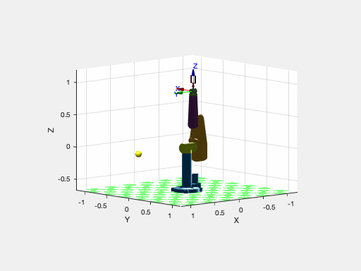
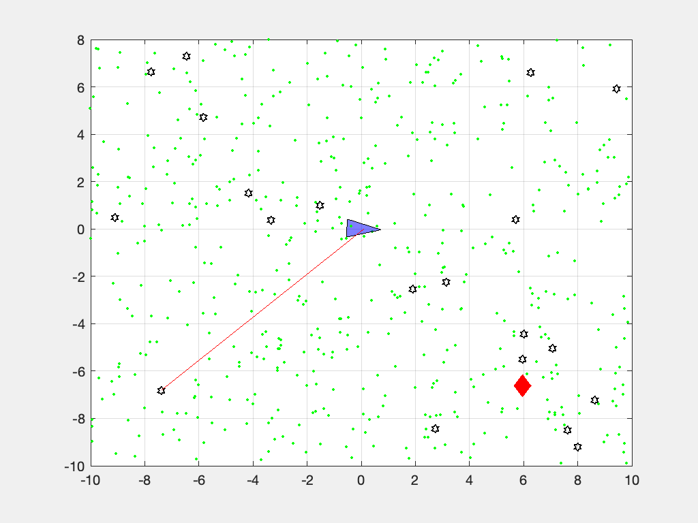

[](https://travis-ci.com/petercorke/robotics-toolbox-matlab)

[](https://www.gnu.org/licenses/lgpl-3.0)
[](https://GitHub.com/petercorke/robotics-toolbox-matlab/graphs/commit-activity)
[](https://GitHub.com/petercorke/robotics-toolbox-matlab/stargazers/)


# Robotics Toolbox for MATLAB&reg; release 10

---
For support please use the [Google group forum](http://groups.google.com/group/robotics-tool-box?hl=en)rather than GitHub issues.  There are more people participating and you'll likely get a quicker response.

---

## Synopsis

This toolbox brings robotics specific functionality to MATLAB, exploiting the native capabilities of MATLAB (linear algebra, portability, graphics).

The Toolbox uses a very general method of representing the kinematics and dynamics of serial-link manipulators as MATLAB®  objects –  robot objects can be created by the user for any serial-link manipulator and a number of examples are provided for well known robots from Kinova, Universal Robotics, Rethink as well as classical robots such as the Puma 560 and the Stanford arm.

The toolbox also supports mobile robots with functions for robot motion models (unicycle, bicycle), path planning algorithms (bug, distance transform, D*, PRM), kinodynamic planning (lattice, RRT), localization (EKF, particle filter), map building (EKF) and simultaneous localization and mapping (EKF), and a Simulink model a of non-holonomic vehicle.  The Toolbox also including a detailed Simulink model for a quadrotor flying robot.

Advantages of the Toolbox are that:

  * the code is mature and provides a point of comparison for other implementations of the same algorithms;
  * the routines are generally written in a straightforward manner which allows for easy understanding, perhaps at the expense of computational efficiency. If you feel strongly about computational efficiency then you can always rewrite the function to be more efficient, compile the M-file using the MATLAB compiler, or create a MEX version;
  * since source code is available there is a benefit for understanding and teaching.
  
This Toolbox dates back to 1993 and significantly predates the [Robotics Systems Toolbox&reg;](https://www.mathworks.com/products/robotics.html) from MathWorks.  The former is free, open and not supported, while the latter is a fully supported commercial product.

## Code Example

```matlab
>> mdl_puma560
>> p560
p560 = 

Puma 560 [Unimation]:: 6 axis, RRRRRR, stdDH, fastRNE            
 - viscous friction; params of 8/95;                             
+---+-----------+-----------+-----------+-----------+-----------+
| j |     theta |         d |         a |     alpha |    offset |
+---+-----------+-----------+-----------+-----------+-----------+
|  1|         q1|          0|          0|     1.5708|          0|
|  2|         q2|          0|     0.4318|          0|          0|
|  3|         q3|    0.15005|     0.0203|    -1.5708|          0|
|  4|         q4|     0.4318|          0|     1.5708|          0|
|  5|         q5|          0|          0|    -1.5708|          0|
|  6|         q6|          0|          0|          0|          0|
+---+-----------+-----------+-----------+-----------+-----------+
 
>> p560.fkine([0 0 0 0 0 0])  % forward kinematics
ans = 
         1         0         0    0.4521
         0         1         0     -0.15
         0         0         1    0.4318
         0         0         0         1
```

We can animate a path



```matlab
mdl_puma560

p = [0.8 0 0];
T = transl(p) * troty(pi/2);
qr(1) = -pi/2;
qqr = p560.ikine6s(T, 'ru');
qrt = jtraj(qr, qqr, 50);

plot_sphere(p, 0.05, 'y');
p560.plot3d(qrt, 'view', ae, 'movie', 'move2ball.gif');
```

### Quadrotor animation

Mobile robot lifting off and hovering over a point following a circular trajectory, while also slowly turning.

```matlab
>> sl_quadrotor
```


### Mobile robot animation
Car-like mobile robot doing a 3-point turn computed using the Reeds-Shepp planner


```matlab
q0 = [0 0 0]'; % initial configuration [x y theta]
qf = [0 0 pi]'; % final configuration
maxcurv = 1/5;   % 5m turning circle
rs = ReedsShepp(q0, qf, maxcurv, 0.05)

% set up a vehicle model for animation
[car.image,~,car.alpha] = imread('car2.png');
car.rotation = 180; % degrees
car.centre = [648; 173]; % pix
car.length = 4.2; % m

% setup the plot
clf; plotvol([-4 8 -6 6])
a = gca;
a.XLimMode = 'manual';
a.YLimMode = 'manual';
set(gcf, 'Color', 'w')
grid on
a = gca;
xyzlabel

% now animate
plot_vehicle(rs.path, 'model', car, 'trail', 'r:', 'movie', '3point.gif');
```

### Particle filter localization animation

Mobile robot localizing from beacons using a particle filter.



```matlab
V = diag([0.1, 1*pi/180].^2);
veh = Vehicle(V);
veh.add_driver( RandomPath(10) );
map = Map(20, 10);
W = diag([0.1, 1*pi/180].^2);
L = diag([0.1 0.1]);
Q = diag([0.1, 0.1, 1*pi/180]).^2;

pf = ParticleFilter(veh, sensor, Q, L, 1000, 'movie', 'pf.mp4');
pf.run(100);
```

A fully commented version of this is provided in the LiveScript `demos/particlefilt.mlx`.

## What's new

* Travis CI is now running on the code base
* All code related to pose representation has been split out into the [Spatial Math Toolbox](https://github.com/petercorke/spatial-math).  This repo is now a dependency.
* `SerialLink` class has a `twists` method which returns a vector of `Twist` objects, one per joint.  This supports the product of exponential formulation for forward kinematics and Jacobians.
* a prototype URDF parser

## Installation

### Install from shared MATLAB Drive folder

This will work for MATLAB Online or MATLAB Desktop provided you have [MATLAB drive](https://www.mathworks.com/products/matlab-drive.html) setup.

1. Click on the appropriate link below and an invitation to share will be emailed to the address associated with your MATLAB account:

  * [RVC 2nd edition RTB10+MVTB4 (2017)](https://drive.matlab.com/sharing/e5e3ffef-f3d4-4f70-88a4-1ea0db0efb1a)
  * [RVC 1st edition: RTB9+MVTB3 (2011)](https://drive.matlab.com/sharing/0442fc1b-5b9e-45c8-abf9-54cbbd00082a)

2. Accept the invitation.
3. A folder named RVC1  or RVC2 will appear in your MATLAB drive folder.
4. Use the MATLAB file browser and navigate to the folder RVCx/rvctools and double-click the script named startup_rvc.m

Note that this is a combo-installation that includes the Machine Vision Toolbox (MVTB) as well.

### Install from github

You need to have a recent version of MATLAB, R2016b or later.

The Robotics Toolbox for MATLAB has dependency on two other GitHub repositories: [`spatial-math`](https://github.com/petercorke/spatial-math) and [`toolbox-common-matlab`](https://github.com/petercorke/toolbox-common-matlab).  

To install the Toolbox on your computer from github follow these simple instructions.

From the shell:

```shell
mkdir rvctools
cd rvctools
git clone https://github.com/petercorke/robotics-toolbox-matlab.git robot
git clone https://github.com/petercorke/spatial-math.git smtb
git clone https://github.com/petercorke/toolbox-common-matlab.git common
make -C robot
```
The last command builds the MEX files and Java class files. Then, from within MATLAB
```matlab
>> addpath rvctools/common  %  rvctools is the same folder as above
>> startup_rvc
```
The second line sets up the MATLAB path appropriately but it's only for the current session.  You can either:
1. Repeat this everytime you start MATLAB
2. Add the MATLAB commands above to your `startup.m` file
3. Once you have run startup_rvc, run `pathtool` and push the `Save` button, this will save the path settings for subsequent sessions.


## Online resources:

* [Home page](http://www.petercorke.com)
* [Discussion group](http://groups.google.com/group/robotics-tool-box?hl=en)

Please email bug reports, comments or code contribtions to me at rvc@petercorke.com
  

## Contributors

Contributions welcome.  There's a user forum at http://tiny.cc/rvcforum

## License

This toolbox is released under GNU LGPL.

# Other MATLAB toolboxes for robotics

* [Compliant joint toolbox](https://github.com/geez0x1/CompliantJointToolbox), MATLAB and Simulink blocks to simulate robots with compliant joints
* [ARTE: Robotics Toolbox for Education](http://arvc.umh.es/arte), a MATLAB toolbox focussed on industrial robotic manipulators, with rich 3D graphics, teach pendants and the ABB RAPID language.
* [RTB interface to V-REP](https://github.com/Rhys-Davies/rtb-sim), a MATLAB class-based interface to the V-REP robotics simulator.  Includes an implementation for the TRS task.
* [MATLAB Interface for Mobile Robots (US NPL)](http://faculty.nps.edu/yun/mri.html), a pure MATLAB toolbox for control of P3 mobile robots.
* [Kuka-Sunrise toolbox](https://github.com/Modi1987/KST-Kuka-Sunrise-Toolbox), A Toolbox used to control KUKA iiwa 7 R 800 robot from an external computer using MATLAB.
* [Robotics System Toolbox](https://au.mathworks.com/products/robotics.html), MathWorks proprietary.
